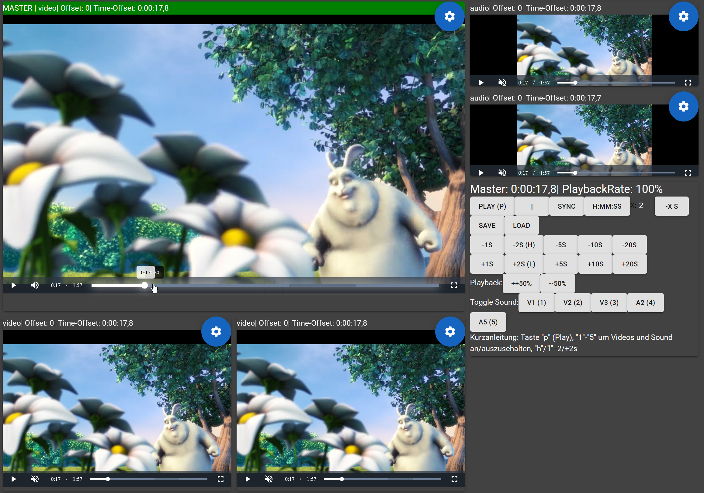

# syncode

## video encoding simultaneously

Watch multiple videos simultaneously. 
This is helpful for the following use cases:
* psychology experiments with multiple camers and audio lines
* ...

Get started:
https://thomasfrei.de/synCode/v2/

Shortcuts:
```
p   Play / Pause
h   Jump 2s back
l   Jump 2s forward

Toggle sound:
1   Video 1
2,3,4,5   
```

Example:


